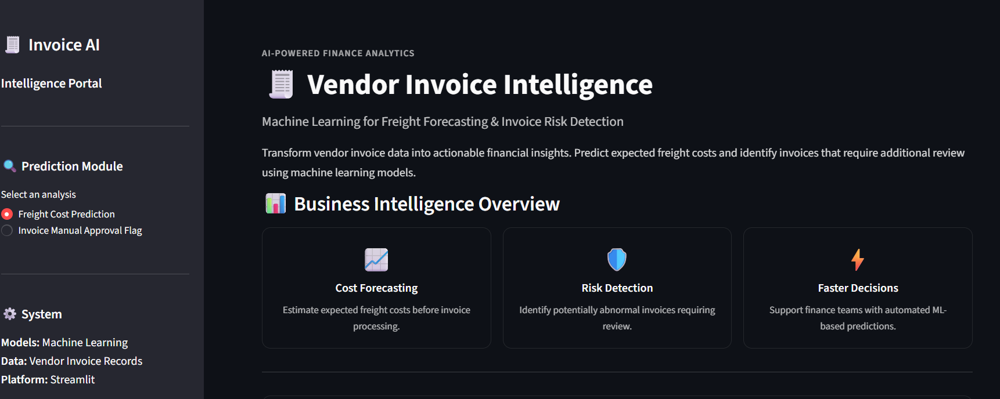
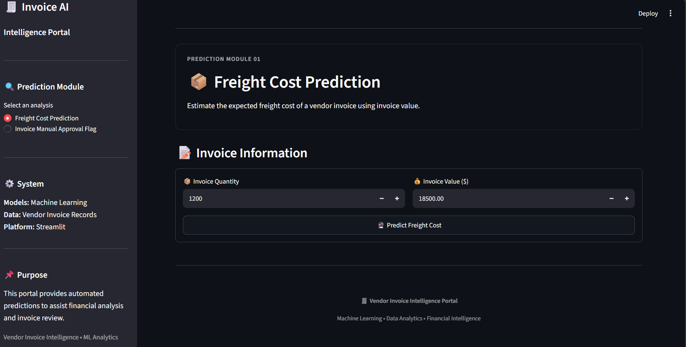
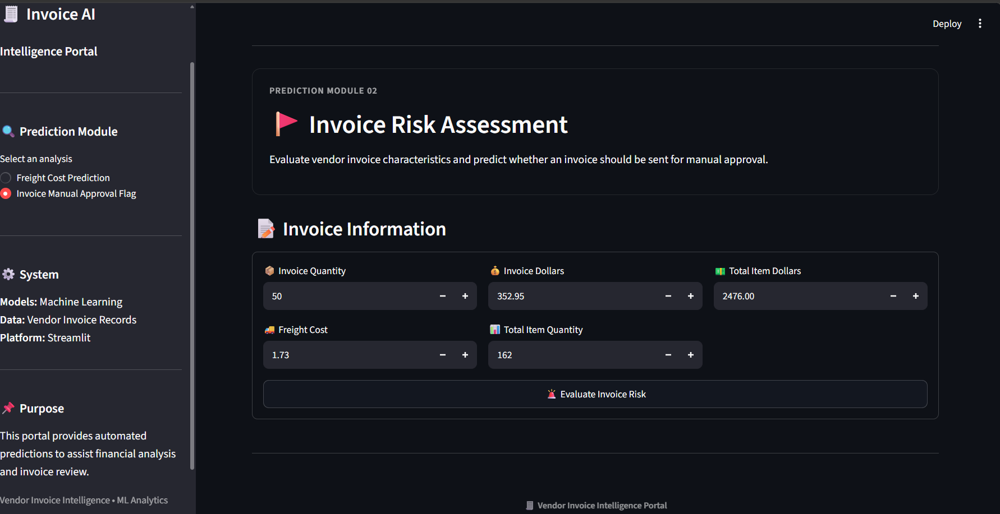

# 🧾 Vendor Invoice Intelligence System
### Freight Cost Prediction & Invoice Risk Flagging


> An end-to-end Machine Learning project that analyzes vendor invoice and purchasing data to predict expected freight costs and identify invoices that may require additional review using SQL, Python, Scikit-learn and Streamlit.

---

## 📑 Table of Contents

- [Project Overview](#-project-overview)
- [Business Problem](#-business-problem)
- [Project Objectives](#-project-objectives)
- [Dataset](#-dataset)
- [Tools & Technologies](#️-tools--technologies)
- [Project Workflow](#-project-workflow)
- [Data Extraction & Preparation](#-data-extraction--preparation)
- [Exploratory Data Analysis](#-exploratory-data-analysis)
- [Statistical Analysis](#-statistical-analysis)
- [Freight Cost Prediction](#-freight-cost-prediction)
- [Invoice Risk Flagging](#-invoice-risk-flagging)
- [Model Evaluation](#-model-evaluation)
- [Model Inference](#-model-inference)
- [Streamlit Application](#-streamlit-application)
- [Project Structure](#-project-structure)
- [How to Run This Project](#️-how-to-run-this-project)
- [Key Insights](#-key-insights)
- [Future Improvements](#-future-improvements)
- [Author & Contact](#-author--contact)

---

## 📖 Project Overview

The **Vendor Invoice Intelligence System** is an end-to-end Machine Learning project designed to analyze vendor invoice and purchasing information.

The project contains two main Machine Learning components:

### 🚚 1. Freight Cost Prediction

A regression pipeline is used to predict the expected freight cost associated with an invoice based on its dollar value.

Multiple regression algorithms were trained and evaluated:

- Linear Regression
- Decision Tree Regressor
- Random Forest Regressor

The trained model is saved and later used through a separate inference pipeline.

### 🚨 2. Invoice Risk Flagging

A classification pipeline is used to identify invoices that may contain unusual financial or operational patterns.

The classification system uses:

- Invoice quantity
- Invoice dollars
- Freight
- Total item quantity
- Total item dollars

A **Random Forest Classifier** is trained and optimized using **GridSearchCV** with F1-score as the optimization metric.

---

## 🎯 Business Problem

Vendor invoice processing can involve large amounts of financial and operational information.

Manually checking every invoice can be time-consuming, while unusual invoice values may require additional investigation.

This project focuses on two practical problems:

### Freight Cost

- Estimate expected freight costs automatically.
- Compare invoice values with expected freight costs.
- Support financial analysis and planning.

### Invoice Risk

- Identify potentially unusual invoices.
- Detect differences between invoice amounts and associated purchase information.
- Consider operational factors such as receiving delays.
- Provide an automated first-level review flag.

The system is intended to **support human review**, rather than replace financial or accounting decisions.

---

## 🎯 Project Objectives

### Objective 1 — Predict Freight Cost

Build and evaluate regression models capable of predicting freight costs from invoice-related information.

### Objective 2 — Detect Potentially Risky Invoices

Build a classification model that identifies invoices that may require additional review.

### Objective 3 — Perform Statistical Analysis

Use statistical testing to investigate differences between flagged and non-flagged invoices.

### Objective 4 — Build a Complete ML Pipeline

Connect:

```text
Database
   ↓
SQL
   ↓
Python
   ↓
Data Preparation
   ↓
EDA
   ↓
Statistical Analysis
   ↓
Machine Learning
   ↓
Model Evaluation
   ↓
Model Saving
   ↓
Inference
   ↓
Streamlit Application
```

---

## 🗄️ Dataset

The project uses an SQLite database named:

```text
inventory.db
```

The database contains multiple tables related to inventory, purchases, pricing and vendor invoices.

Important tables include:

- `vendor_invoice`
- `purchases`
- `purchase_prices`
- `begin_inventory`
- `end_inventory`

### Vendor Invoice Data

The `vendor_invoice` table provides information such as:

- Purchase order number
- Invoice date
- Purchase order date
- Payment date
- Invoice quantity
- Invoice dollars
- Freight

### Purchase Data

The `purchases` table provides item-level purchasing information such as:

- Purchase order number
- Brand
- Quantity
- Dollars
- Purchase date
- Receiving date

SQL aggregation was used to create invoice-level purchasing features from the underlying purchase data.

---

## 🛠️ Tools & Technologies

### Programming

- Python

### Data Analysis

- Pandas
- NumPy

### Database

- SQLite
- SQL

### Machine Learning

- Scikit-learn
- Linear Regression
- Decision Tree Regressor
- Random Forest Regressor
- Random Forest Classifier
- GridSearchCV

### Statistical Analysis

- T-tests
- P-values

### Visualization

- Matplotlib

### Model Persistence

- Joblib

### Application

- Streamlit

### Version Control

- Git
- GitHub

### Development Environment

- Jupyter Notebook
- VS Code / Python

---

## 🔄 Project Workflow

The complete project follows this workflow:

```text
SQLite Database
      ↓
SQL Data Extraction
      ↓
Data Cleaning & Preparation
      ↓
Exploratory Data Analysis
      ↓
Statistical Analysis
      ↓
Feature Engineering
      ↓
Train/Test Split
      ↓
Machine Learning
      ↓
Model Evaluation
      ↓
Hyperparameter Tuning
      ↓
Model Persistence
      ↓
Inference
      ↓
Streamlit Application
```

---

## 🧹 Data Extraction & Preparation

SQL was used to extract and combine invoice-level and purchase-level information.

For invoice risk analysis, purchase-level information was aggregated by purchase order.

The feature engineering process included:

- Total number of brands
- Total item quantity
- Total item dollars
- Average receiving delay
- Invoice quantity
- Invoice dollars
- Freight
- Days from purchase order to invoice
- Days from invoice to payment

The invoice risk label was created using business rules based on differences between invoice and purchase values and receiving delays.

### Example Risk Logic

An invoice can be assigned a review flag when:

```text
Invoice Dollars - Total Item Dollars
```

shows a significant difference, or when the average receiving delay exceeds the defined threshold.

---

## 🔍 Exploratory Data Analysis

Exploratory Data Analysis was performed to understand the structure and relationships within the invoice and purchasing data.

The analysis investigated:

- Invoice quantities
- Invoice dollar values
- Freight costs
- Purchase quantities
- Purchase dollar values
- Receiving delays
- Payment timing
- Differences between flagged and non-flagged invoices

EDA helped identify potentially useful variables before building the Machine Learning models.

---

## 📊 Statistical Analysis

Statistical analysis was performed using independent two-sample t-tests.

The following variables were investigated:

- Invoice quantity
- Invoice dollars
- Freight
- Days from PO to invoice
- Days to pay
- Total item quantity
- Total item dollars
- Average receiving delay

The analysis produced statistically significant p-values below 0.05 for the tested variables in the project dataset.

For example:

| Variable | p-value |
|---|---:|
| Invoice Quantity | 0.0213 |
| Invoice Dollars | 0.00805 |
| Freight | 0.00818 |
| Days PO to Invoice | 5.45e-42 |
| Days to Pay | 2.26e-13 |
| Total Item Quantity | 0.0213 |
| Total Item Dollars | 0.00805 |
| Average Receiving Delay | 7.24e-102 |

These tests were used to understand whether the distributions differed between the invoice groups used in the analysis.

---

# 🚚 Freight Cost Prediction

## Objective

Predict the expected freight cost associated with an invoice.

The freight prediction model currently uses:

```text
Dollars
```

as the model feature and:

```text
Freight
```

as the target variable.

---

## 🤖 Regression Models

Three regression algorithms were evaluated:

### 1. Linear Regression

Used as a simple baseline regression model.

### 2. Decision Tree Regressor

Used to capture non-linear relationships between invoice value and freight cost.

### 3. Random Forest Regressor

Used as an ensemble model combining multiple decision trees.

The models were evaluated using:

- MAE
- RMSE
- R² Score

The selected model was saved using Joblib and reused during inference.

---

# 🚨 Invoice Risk Flagging

## Objective

Identify invoices that may require additional manual review.

The classification model uses the following five features:

```text
invoice_quantity
invoice_dollars
Freight
total_item_quantity
total_item_dollars
```

The target variable is:

```text
flag_invoice
```

where:

```text
0 = No review flag
1 = Review flag
```

---

## 🌲 Random Forest Classification

A Random Forest Classifier was trained for invoice risk classification.

Hyperparameter optimization was performed using:

```text
GridSearchCV
```

The search evaluated combinations of:

- Number of estimators
- Maximum depth
- Minimum samples split
- Minimum samples leaf
- Criterion

Five-fold cross-validation was used during the search.

The optimization metric was:

```text
F1-score
```

This was selected to balance precision and recall for the invoice classification problem.

---

## 📏 Model Evaluation

### Freight Prediction Metrics

The regression models were evaluated using:

- **MAE — Mean Absolute Error**
- **RMSE — Root Mean Squared Error**
- **R² Score**

### Invoice Classification Metrics

The Random Forest Classifier was evaluated using:

- **Accuracy**
- **Precision**
- **Recall**
- **F1-score**
- **Classification Report**

The dataset contained:

```text
Normal invoices: 2968
Flagged invoices: 1466
```

The train/test split was performed using an 80/20 split with a fixed random state.

---

## 💾 Model Persistence

Trained models and preprocessing objects are saved using **Joblib**.

The project includes saved model artifacts for:

```text
Freight Prediction Model
Invoice Risk Classification Model
Feature Scaler
```

This allows the trained models to be loaded later without retraining them every time the application starts.

---

## 🔮 Model Inference

Separate inference scripts were created to make predictions using the saved models.

### Freight Prediction

```text
inference/predict_freight.py
```

Example input:

```python
{
    "Dollars": [18500, 9000, 3000, 200]
}
```

Example prediction output:

```text
Dollars    predicted_Freight
18500      98.0
9000       50.0
3000       20.0
200         6.0
```

### Invoice Risk Prediction

```text
inference/predict_invoice_flag.py
```

Example input:

```python
{
    "invoice_quantity": [50],
    "invoice_dollars": [352.95],
    "Freight": [1.73],
    "total_item_quantity": [162],
    "total_item_dollars": [2476.0]
}
```

The inference pipeline loads:

- The trained Random Forest model
- The saved StandardScaler
- The required input features

and returns the predicted invoice flag.

---

# 🖥️ Streamlit Application

A Streamlit application was developed to provide an interactive interface for the trained Machine Learning models.

The application contains two major modules.

### 🚚 Freight Cost Prediction

Users can enter invoice information and receive an estimated freight cost.

### 🚨 Invoice Risk Detection

Users can enter invoice-related information and receive a Machine Learning prediction indicating whether the invoice has been flagged for additional review.

### Application Home



### Freight Cost Prediction



### Invoice Risk Detection



---

## 📊 Application Features

The Streamlit application provides:

- Interactive invoice inputs
- Freight cost prediction
- Invoice risk prediction
- Human-readable prediction results
- Separate modules for regression and classification
- Saved model loading
- Real-time inference

---

## 📁 Project Structure

```text
Machine Learning Project/
│
├── Data/
│   └── inventory.db
│
├── Freight_cost_prediction/
│   ├── data_preprocessing.py
│   ├── modeling_evaluation.py
│   └── train.py
│
├── invoice_flagging/
│   ├── data_preprocessing.py
│   ├── modeling_evaluation.py
│   ├── train.py
│   └── models/
│       └── scaler.pkl
│
├── inference/
│   ├── predict_freight.py
│   └── predict_invoice_flag.py
│
├── models/
│   └── predict_freight_model.pkl
│
├── notebooks/
│   └── Machine Learning notebooks
│
├── images/
│   ├── app_home.png
│   ├── freight_prediction.png
│   └── invoice_risk_detection.png
│
├── app.py
├── README.md
└── .gitignore
```

> The `inventory.db` database is kept locally and excluded from GitHub because of its file size.

---

# ▶️ How to Run This Project

## 1. Clone the Repository

```bash
git clone https://github.com/amalrs3000-star/Vendor-Invoice-Intelligence-System-ML-Project.git
```

```bash
cd "Machine Learning Project"
```

## 2. Install Required Libraries

```bash
pip install pandas numpy scikit-learn matplotlib joblib streamlit
```

## 3. Train the Freight Prediction Model

```bash
python Freight_cost_prediction/train.py
```

## 4. Train the Invoice Risk Model

```bash
python invoice_flagging/train.py
```

## 5. Test Freight Prediction

```bash
python inference/predict_freight.py
```

## 6. Test Invoice Risk Prediction

```bash
python inference/predict_invoice_flag.py
```

## 7. Run the Streamlit Application

```bash
streamlit run app.py
```

---

# 💡 Key Insights

### 📌 Insight 1 — Freight Prediction

Invoice dollar value can be used as a predictive feature for estimating expected freight cost.

The project demonstrates how a regression model can learn the relationship between invoice value and freight cost from historical data.

### 📌 Insight 2 — Invoice Value Differences

Differences between invoice dollar values and aggregated purchase dollar values can provide useful information for identifying potentially unusual invoices.

### 📌 Insight 3 — Receiving Delay

Average receiving delay showed a strong statistical difference between invoice groups in the project dataset.

This was investigated as a potentially useful variable for invoice-risk classification.

### 📌 Insight 4 — Multiple Features Improve Risk Analysis

Invoice risk analysis combines financial and operational information rather than relying on a single variable.

The classification model uses:

```text
Invoice Quantity
Invoice Dollars
Freight
Total Item Quantity
Total Item Dollars
```

### 📌 Insight 5 — Statistical Analysis Supports Feature Investigation

The statistical testing performed during the project produced p-values below 0.05 for the tested variables.

This helped investigate which variables differed between the invoice groups used for the classification analysis.

---

# 🔮 Future Improvements

Possible future improvements include:

- Add more invoice-level features
- Improve the business rules used to create risk labels
- Compare additional classification algorithms
- Perform more extensive feature engineering
- Add feature importance visualizations
- Add SHAP-based model explainability
- Improve Streamlit dashboard design
- Add interactive EDA visualizations
- Connect the application directly to a production database
- Deploy the application to a cloud platform
- Add automated model monitoring
- Implement periodic model retraining

---

# 🎓 Key Learning Outcomes

This project provided practical experience with:

- Python programming
- Pandas
- NumPy
- SQL
- SQLite
- Data preprocessing
- Feature engineering
- Exploratory Data Analysis
- Statistical hypothesis testing
- Regression
- Classification
- Random Forest
- Decision Trees
- GridSearchCV
- Model evaluation
- Feature scaling
- Joblib model persistence
- Machine Learning inference
- Streamlit application development
- Git
- GitHub
- End-to-end Machine Learning project structure

---

## 👨‍💻 Author & Contact

### Amal.RS

**B.Tech Artificial Intelligence & Data Science**

### Interests

Data Science | Machine Learning | Data Analytics | Artificial Intelligence | Generative AI | Agentic AI

### GitHub

https://github.com/amalrs3000-star

### LinkedIn

https://linkedin.com/in/amal-rs-973a24303

---

## ⭐ Project

If you found this project useful or interesting, feel free to explore the repository and give it a ⭐ on GitHub.

---

### 📌 Disclaimer

This project is created for educational and portfolio purposes.

The invoice risk prediction is intended to support additional review and should not be treated as a replacement for professional financial, accounting, or auditing decisions.edict_invoice_flag.py
streamlit run app.py

